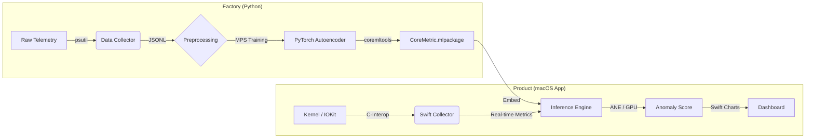

# CoreMetric: Native macOS Anomaly Detection (WIP)


**CoreMetric** is a privacy-first, neural-powered system monitor for macOS. Unlike traditional monitors that rely on hard-coded thresholds (e.g., "Alert if CPU > 90%"), CoreMetric uses a **Reconstruction Autoencoder** running on the Apple Neural Engine (ANE) to learn your specific usage patterns and detect subtle anomalies—like memory leaks, background crypto-miners, or frozen processes.

---

## 🏗 System Architecture

The project is divided into two distinct pipelines: **The Factory** (Python/Training) and **The Product** (Swift/Inference).



## ✨ Technical Highlights

### 1. Hybrid ML Architecture
- **Training:** Uses PyTorch with Metal Performance Shaders (MPS) to train an Autoencoder on historical system telemetry.
- **Inference:** The model is quantized and converted to Core ML to run on the **Apple Neural Engine**, ensuring <1% CPU overhead.
- **Dynamic Calibration:** Scaling parameters (Mean/Std) are calculated during training and embedded directly into the Core ML model metadata, allowing the Swift app to auto-calibrate without code changes.

### 2. Low-Level Data Collection
- **Python (Training):** Utilizes `psutil` for high-frequency logging of CPU, RAM, Disk I/O, and Context Switches.
- **Swift (Runtime):** Implements a zero-dependency collector using Darwin kernel APIs (`host_statistics64`, `libproc`) and `IOKit` to gather bare-metal metrics.

### 3. One-Class Classification
- The model is trained purely on "Normal" data.
- Anomalies are detected by calculating the **Reconstruction Error (MSE)** between the input state and the model's output. High error = Unknown system state.

---

## 🚀 Getting Started

### Prerequisites
- macOS 13.0+ (Ventura or newer)
- Xcode 15+
- Python 3.10+

### Phase 1: Data Collection & Training
Before the app can work, it needs to learn *your* machine's heartbeat.

1. **Install Dependencies:**
   ```bash
   pip install -r requirements.txt
   ```

2. **Collect Data (24h recommended):**
   Run the background daemon to log system metrics.
   ```bash
   python collector/src/collect.py
   ```

3. **Train the Model:**
   This pipeline cleans the data, trains the Autoencoder, and exports `CoreMetric.mlpackage`.
   ```bash
   python training/train.py
   ```

### Phase 2: Building the App
1. Open `MLMonitor/MLMonitor.xcodeproj` in Xcode.
2. Ensure `CoreMetric.mlpackage` (generated in Phase 1) is added to the project target.
3. Build and Run (**Cmd+R**).

---

## 📂 Repository Structure

```text
CoreMetric/
├── collector/          # Python daemon for raw data acquisition
├── training/           # PyTorch pipeline & Core ML conversion
├── data/               # Raw training logs (ignored by git)
└── MLMonitor/          # Native macOS Application
    ├── SystemCollector.swift  # Darwin/C kernel interface
    ├── InferenceEngine.swift  # Core ML Wrapper & Metadata parser
    └── ContentView.swift      # SwiftUI Dashboard & Charts
```

## 🛡 Privacy

CoreMetric processes all data **on-device**. 
- No telemetry is sent to the cloud.
- The model runs locally using the Apple Neural Engine.
- Training data never leaves your local `data/` folder.

---

## 📜 License

MIT License. Copyright (c) 2025.
